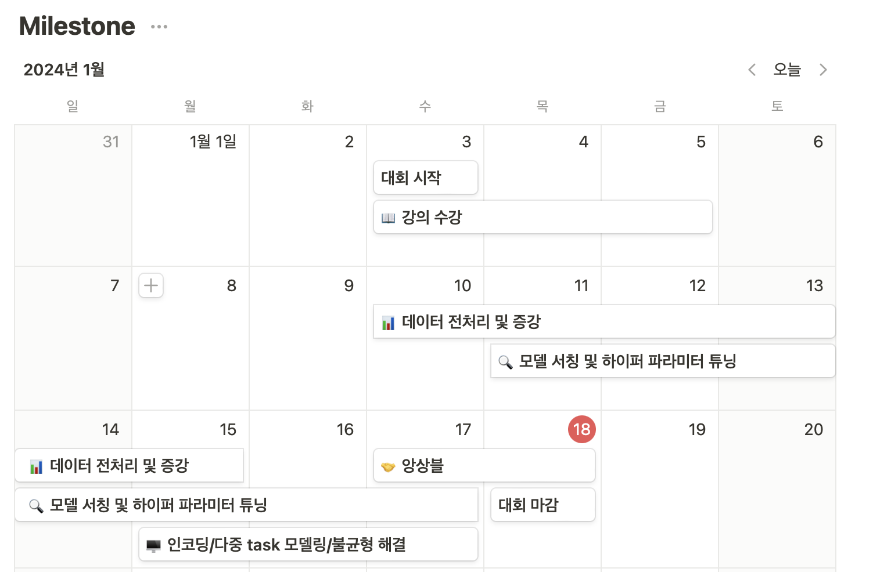

# 🏆**Level2 Project - RE(Relation Extraction)**


## ✏️**대회 소개**

<div align='center'>

|특징|설명|
|:--:|--|
|**대회 주체**|네이버 부스트캠프 AI-Tech 6기 NLP트랙의 level2 실전 프로젝트 대회입니다.|
|**대회 설명**|문장, 단어에 대한 정보를 통해, 문장 속에서 단어 사이의 관계(Relation Extraction)를 추론하는 모델을 학습하는 task였습니다.|
|**데이터 구성**|데이터는 wikipedia, wikitree, policy_briefing으로 구성되어 있습니다. Train(32470개), Test(7765개) |
|**평가 지표**|모델의 평가지표는 No_relation 클래스를 제외한 Micro F1 Score와 모든 클래스에 대한 AUPRC로 측정했습니다.|
</div>


<br>

## 👨‍💻Team & Members

* **Team명** : **더닝크루거 [NLP 2조]**


### 🧚**Members**

<div align='center'>

|구다연[](https://github.com/9ooDa)|김동현[](https://github.com/valofosho)|김유민[](https://github.com/miniminii)|김희범[](https://github.com/C7C4FF)|이민아[](https://github.com/minari1505)|이지인[](https://github.com/Boribori12)|
|:--:|:--:|:--:|:--:|:--:|:--:|
|||||||
|[Mail](dayeonkuhk@gmail.com)|[Mail](whgdk1880@gmail.com)|[Mail](sksdjssl3148@gmail.com)|[Mail](c7c4ff.beom@gmail.com)|[Mail](minari1505@naver.com)|[Mail](sos000523@naver.com)|
</div>

<br>

### 💯**Our Team's Goal**
> 팀 단위 프로젝트인만큼 최대한 다양한 시도를 분업하여 서로의 작업이 겹치지 않도록 주의하며 진행했습니다. 진행했던 전처리 방법론과 모델링의 성능 변화 추세와 그 이유를 분석하고, 협업툴로 공유하여 팀원 모두의 공부를 목표로 프로젝트를 진행했습니다.

<br>

### 👼**Member's role**
|**Member**|**Role**|
|--|--|
|**구다연**|**전처리**, **모델링 및 튜닝**, **앙상블**|
|**김동현**|**EDA**, **전처리**, **모델링 및 튜닝**, **앙상블**, **WandB 연동 및 시각화**, **코드 리팩토링**|
|**김유민**|**전처리**, **모델링 및 튜닝**, **WandB**|
|**김희범**|**베이스라인 리팩토링 및 구조 작성**, **전처리**, **모델링 및 튜닝**, **앙상블**|
|**이민아**|**전처리**, **모델링 및 튜닝**, **loss 생성 및 튜닝**|
|**이지인**|**데이터 증강**, **회의 진행 및 회의록 작성**|


<br>

## 🏃**Project process**

### 🖥️ Project Introduction
|**개요**|**Description**|
|:--:|--|
|**프로젝트 주제** | **`RE(Relation Extraction)`** : 문장 내 개체 간 관계를 예측하는 30개의 라벨로 중 하나로 분류하는 문제|
|**프로젝트 목표**| 다양한 전처리 기법과 모델링을 활용하여 문장, 단어에 대한 정보를 통해 ,문장 속에서 단어 사이의 관계를 추론하는 모델을 생성
|**프로젝트 평가지표**|No_relation 클래스를 제외한 **Micro F1 Score**, 모든 클래스에 대한 **AUPRC**(Area Under the Precision-Recall Curve)|
|**개발 환경**|**`GPU` : Tesla V100 Server 6대**, **`IDE` : Vscode, Jupyter Notebook**|
|**협업 환경**|**`Notion`**(진행 상황 공유), **`Github`**(코드 및 데이터 공유), **`Slack`**(실시간 소통) |

<br>

### 📅**Project TimeLine**

* 프로젝트는 2024-01-03 ~ 2024-01-18 약 15일간 진행되었습니다.



<br>

### 🕵️**What we did**

* 프로젝트를 진행하며 단계별로 실험해 보고 적용해 본 내용들은 아래와 같습니다.
* 보다 자세한 사항은 [📋Wrap-up Report](https://supreme-kilogram-785.notion.site/Wrap-up-Report-0b47d31a89474f25b8ca6a749022c2e2?pvs=4)를 참고해주시기 바랍니다.

|**Process**|**What we did**|
|:--:|--|
|**EDA**|`데이터 분포 분석`, `데이터 길이 분석`, `Baseline 모델 예측라벨과 실제 라벨 차이 분석`|
|**Preprocessing**|`중복 행 제거`, `특수문자 제거`, `hanja(한자-한글 변환)`, `hanspell(맞춤법검사)`,`pykospacing(띄어쓰기 재정렬)`|
|**Augmentation**|`EDA(Easy-Data-Augmentation)`, `entity swap`|
|**Experiment Model**|`klue/bert-base`, `ainize/klue-bert-base-re`,`kakaobank/kf-deberta-base`,`bespin-global/klue-sentence-roberta-base-kornlu`,`klue/roberta-large`, `monologg/koelectra-base-v3-discriminator`,`xlm-roberta-large`,`team-lucid/deberta-v3-xlarge-korean`|
|**Hyper-parameter tuning & Mornitoring**| `Wandb Sweep`|
|**Visualization**| `Plotly`|
|**Ensemble**|`weighted voting`, `soft voting`, `hard voting`|


### 🤖**Ensemble Model**

* 최종적으로 4개의 모델을 앙상블에 사용하였습니다.

|**Model**|**Learing Rate**|**Batch Size**|**loss**|**epoch**|**Dataset**|**Entity Marker**|**Public Micro F1 Score**|**Public AUPRC**|
|:--:|:--:|:--:|:--:|:--:|:--:|:--:|:--:|:--:|
|**klue/RoBERTa-large**|3e-5|32|FocalLoss|3|dist_1|tem_punt_question|73.8103|78.0330|
|**klue/RoBERTa-large**|3e-5|32|FocalLoss|3|Filter_duplicates_1|tem_punt_question|72.8334|78.5174|
|**xlm-roberta-large**|5e-5|48|FocalLosss|3|dist_1|tem_punt_question|68.4932|75.6809|
|**kakaobank/kf-deberta-base**|5e-5|32|FocalLoss|3|dist_1|tem_punt_question|72.9120|76.9670|

<br>

## **📁Project Structure**

### **📁디렉토리 구조 설명**
* 학습 데이터 경로 : `./data`
* 모델 및 Sweep Config 경로 : `./config`
* 학습된 모델 생성 경로 : `./best_model`
* 추론 결과 생성 경로 : `./prediction`
* 앙상블 코드 경로: `./ensemble`


### **📁📁코드 구조 설명**
1. **Preprocessing 설정 코드 경로**: `./preprocessing/preprocessing.py`
2. **Config 설정 코드 경로** : `./config/`
3. **Model Train 코드 위치** : `./train.py`
    - 모델 .pt파일 생성 경로 : `./best_model/`
4. **Infer 코드 위치** : `./inference.py`
    - 추론 결과 .csv파일 생성 경로 : `./prediction/`
5. **Ensemble 코드 위치** : `./ensemble/ensemble.py`

```
📦 
├─ best_model
├─ config
│  ├─ config.yaml
│  └─ sweep.yaml
├─ data
├─ dataset
│  ├─ dict_label_to_num.pkl
│  ├─ dict_num_to_label.pkl
│  └─ wordnet.pickle
├─ prediction
├─ preprocessing
│  ├─ eda.py
│  ├─ entity_swap.py
│  ├─ train_dev_split.py
│  ├─ spacing.py
│  ├─ filter_duplicates.py
│  ├─ filter_japanese.py
│  ├─ translate_hanja.py
│  └─ clean_special_chars.py
├─ result
├─ trainer
│  └─ trainer.py
├─ utils
│  ├─ compute_metrics.py
│  ├─ get_model.py
│  ├─ labeling.py
│  └─ set_seed.py
├─ ensemble
│  ├─ utils.py
│  ├─ ensemble.py
│  ├─ ensemble_data
│  └─ ensemble_output
├─ inference.py
├─ train.py
├─ sweep.py
└─ run.py
```

<br>

## **💻Getting Started**

### 🛠️**Requirements**
```
# 필요 라이브러리 설치
> pip install -r requirements.txt
```

### **📊Make Dataset**
```
# 데이터 전처리
> python ./preprocessing/preprocessing.py
```

### **🤖Train Model**
```
# ./config 에서 훈련 모델의 config 설정
# config.yaml은 자동으로 적용
> python train.py
```

### **🤖Predict Label**
```
# 학습된 모델로 라벨 예측
> python inference.py
```

### **🤖Ensemble Outputs**
```
# Ensemble
> python ./ensemble/ensemble.py
```